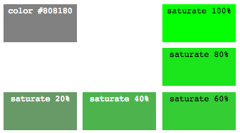
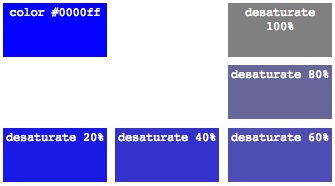
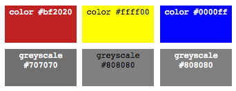

#{9: cores }
Less possui várias funções para geração, combinação, filtragem e mesclagem de cores. A maioria gera como resultado uma representação de cor em CSS no formato hexadecimal `#rrggbb`.

##definição de cores
Várias das funções de definição de cores já existem em CSS (ex: `rgb(r,g,b)`), mas algumas só existem desde versões mais recentes e não têm suporte em browsers antigos (`hsl`, `hsla`, etc.). O Less converte essas funções em formatos hexadecimais `#rrggbb` ou na função `rgba(r,g,b,a)` do CSS, quando a cor tiver um componente alfa. Ou seja, o seguinte código em Less:

```
@componente: 128;
.secao2 {
  color: rgb(@componente,255,255);
}
```
irá gerar o seguinte CSS:

```
.secao2 {
  color: #80ffff;
}
```
Se você quiser manter a função `rgb` no CSS (em vez de converter para `#hhhhhh`), é necessário incluir o valor entre aspas e depois removê-las com o operador `~`:

```
@componente: 128;
.secao1 {
  color: ~'rgb(@{componente},255,255)';
}
```
que irá preservar o string como ele foi declarado:

```
.secao1 {
  color: rgb(128,255,255);
}
```

### funções do CSS
As funções abaixo são réplicas das funções suportadas por CSS1 e 2 (`rgb`, `rgba`) e CSS3 (`hsl`, `hsla`). Todas geram código em formato `#hhhhhh` ou `rgba(r,g,b,a)`.

As funções `rgb` e `rgba` geram uma cor a partir de componentes de luz vermelha, verde e azul (números de 0 a 255, ou 0 a100%), mais um componente alfa (transparência) entre 0 e 1 (0 a 100%). 

RGB é um espaço de cores dependente de hardware. HSL é mais intuitivo: escolhe-se a *matiz* da cor, a *saturação* e intensidade da *luz*. Uma cor é representada em HSL por 

* **hue**: um ângulo que representa a matiz (0 ou 360 = vermelho)
* **saturation**: um número entre 0 e 1 (0 - 100%) que representa a saturação
* **lightness**: um número entre 0 e 1 (0 - 100%) que representa a quantidade de luz

Uma cor 100% saturada como `#ff0000` é representada em HSL como H=0, S=1, L=0.5 (L = 0 é nenhuma luz, preto, L = 1 é branco). A matiz começa e termina em vermelho e é um círculo contínuo, assim pode-se ultrapassar o valor máximo. 0, 360, 720 = vermelho, 120, 480, ... = verde, 240, 600, ... = azul.

Função | Recebe | Retorna
--|--|--
`rgb(r,g,b)` | números (0-255) ou percentagem | cor em hexadecimal. ex: `rgb(255,0,0)` gera `#ff0000`, `rgb(100%,0,0)` gera `#ff0000`.
`rgba(r,g,b,a)` |`r,g,b` = números (0-255) ou percentagem, `a` = número entre 0 e 1 ou percentagem | a mesma função em CSS: `rgba(255,255,255, 0.5)` gera `rgba(255,255,255, 0.5)` 
`hsl(h,s,l)` | `h` = ângulo, `s,l` = números entre 0 e 1 ou percentagem  | cor em hexadecimal. ex: `hsl(360,1,0.5)` gera `#ff0000`
`hsla(h,s,l,a)` | `h` = ângulo, `s,l,a` = números entre 0 e 1 ou percentagem  | função rgba do CSS correspondente: `hsla(0,1,0.5,0.5)` gera `rgba(255, 0, 0, 0.5)`

### funções HSV

O espaço de cores HSV tem como principal diferença em relação ao HSL o componente de intensidade de luz, que é chamado de Value (ou Brilho/Brightness) e é definido como o valor do maior componente da cor, em contraste com o HSL que define lightness como um valor médio. Portanto, L=0.5 em HSL equivale a V=1 em HSV.

Estas funções não existem no CSS, portanto são convertidas em `#hhhhhh` ou `rgba` pelo processador Less.

Função | Recebe | Retorna
--|--|--
`hsv(h,s,v)` | `h` = ângulo, `s,v` = números entre 0 e 1 ou percentagem | cor em hexadecimal. ex: `hsv(360deg,1,1)` gera `#ff0000`
`hsva(h,s,v,a)` | `h` = ângulo, `s,v,a` = números entre 0 e 1 ou percentagem | função rgba do CSS correspondente: `hsva(0,1,1,0.5)` gera `rgba(255, 0, 0, 0.5)`

Exemplos:

```
@color1: rgb(100%,50%,25%);
@color2: rgba(128,255,64,0.5);
@color3: hsl(120deg,50%,25%);
@color4: hsla(240deg,100%,75%,75%);
@color5: hsv(120deg,50%,50%);
@color6: hsva(240deg,50%,50%,50%);

.colors {
  border-top-color: @color1;
  border-right-color: @color2;
  border-bottom-color: @color3;
  border-left-color: @color4;
  background-color: @color5;
  color: @color6;
}
```
Resultado em CSS:

```
.colors {
  border-top-color: #ff8040;
  border-right-color: rgba(128, 255, 64, 0.5);
  border-bottom-color: #206020;
  border-left-color: rgba(128, 128, 255, 0.75);
  background-color: #408040;
  color: rgba(64, 64, 128, 0.5);
}
```

##extração de componentes de cores
Estas funções recebem cores e extraem seus componentes individuais nos espaços RGB, RGBA, HSL, HSLA, HSV e HSVA. Os componentes são retornados como números decimais.

### componentes rgba
Função | Recebe | Retorna
--|--|--
`red(c)` | cor | número decimal com valor do componente vermelho (`r`): `red(#ff8040)` = 255 (hex ff)
`green(c)` | cor | número decimal com valor do componente verde (`g`): `red(#ff8040)` = 128 (hex 80)
`blue(c)` | cor | número decimal com valor do componente azul (`b`): `red(#ff8040)` = 64 (hex 40)
`alpha(c)` | número | número decimal com valor do componente alfa (transparência) (`a`): `alpha(#ff8844)` = 1, `alpha(fade(@cor, 50%))` = 0.5

### componentes hsl e hsv
Função | Recebe | Retorna
--|--|--
`hue(c)` | cor | número inteiro com o ângulo da matiz do espaço HSL. `hue( #8080ff )` gera `240`.
`saturation(c)` | cor | percentagem de saturação no espaço HSL. `saturation(#8080ff)` gera `100%`.
`lightness(c)` | cor | percentagem de luminosidade no espao HSL. `lightness(#8080ff)` gera `75%`.
`hsvhue(c)` | cor | número inteiro com o ângulo da matiz no espaço HSV. ` hsvhue(#8080ff)` gera `240`.
`hsvsaturation(c)` | cor | percentagem de saturação no espaço HSV. `hsvsaturation(#8080ff)` gera `50%`.
`hsvvalue(c)` | cor | percentagem de brilho no espaço HSV. `hsvvalue(#8080ff)` gera `100%`.

Exemplos:

```
@color2: rgba(64,255,64,0.5);
@color4: hsla(240deg,100%,75%,75%);
@color6: hsva(240deg,50%,50%,50%);

.color-components-rgba {
  content: red(@color2), green(@color4), blue(@color6), alpha(@color4);
}

.color-components-hsla {
  content: hue(@color4), saturation(@color4), lightness(@color6);
}

.color-components-hsva {
  content: hsvhue(@color2), hsvsaturation(@color4), hsvvalue(@color6);
}
```
Resultado em CSS:

```
.color-components-rgba {
  content: 64, 127.5, 127.5, 0.75;
}
.color-components-hsla {
  content: 240, 100%, 38%;
}
.color-components-hsva {
  content: 120, 50%, 50%;
}
```

###luma
A função luma retorna um percentual que indica a luminância relativo de uma cor (brilho perceptível) de acordo com a recomendações W3C de accessibilidade.

Função | Recebe | Retorna
--|--|--
`luma(c)` | cor | uma percentagem do brilho perceptível (luma) da cor. Ex: `luma(red)` gera `21%`.

Exemplo:

```
.sec {
  content: luma(white), luma(yellow), luma(cyan), luma(magenta),
  content: luma(red),  luma(green),  luma(blue), luma(black);
}
```

Em CSS:

```
.sec {
  content: 100%, 93%, 79%, 28%, 
  content: 21%, 15%, 7%, 0%;
}
```

##operações sobre cores individuais
Estas funções alteram os componentes de cores individuais e retornam uma cor modificada, mais clara ou escura, mais ou menos saturada, com a matiz ou transparência alteradas.

### saturação
Estas funções alteram a saturação e usam o espaço de cores HSL.

Função | Recebe | Retorna
--|--|--
`saturate(c,p)` | `c` = cor, `p` = percentagem | cor com a saturação aumentada na porcentagem indicada (até a saturação máxima). Ex: `saturate(#808180, 20%)` gera `#679a67` e `saturate(#808180, 100%)` gera `#02ff02`.
`desaturate(c,p)` | `c` = cor, `p` = percentagem | cor com a saturação diminuída na porcentagem indicada (até a saturação mínima). Ex: `desaturate(#0000ff, 60%)` gera `#4d4db3` e `desaturate(#0000ff, 100%)` gera `#808080`.
`greyscale(c)` | cor | cor completamente de-saturada. Mesmo que desaturate(c, 100%). Ex: `greyscale(#ffff00)` gera `#808080`.

Exemplos: 

`saturate(#808180, 0 a 100%)`:



`desaturate(#0000ff, 0 a 100%)`:



`greyscale(#bf2020)`, `greyscale(#ffff00)`, `greyscale(#0000ff)`:



### luminância
Estas funções tornam a cor mais clara ou mais escura.

Função | Recebe | Retorna
--|--|--
`lighten(c,p)` | `c` = cor, `p` = percentagem | cor com a luminância aumentada na percentagem indicada (até a máxima).
`darken(c,p)` | `c` = cor, `p` = percentagem | cor com a luminância diminuída na percentagem indicada (até a mínima).

Exemplos de `darken` e `lighten`:

 ```
 @color: #ff0000;
.light {
  background-color: lighten(@color, 25%);
}
.dark {
  background-color: darken(@color, 25%);
}
 ```
 
 CSS:
 
 ```
 .light {
  background-color: #ff8080;
}
.dark {
  background-color: #800000;
}
 ```

### matiz
A função spin recebe um ângulo que é aplicado sobre o círculo ou cone de cores, variando a matiz.

Função | Recebe | Retorna
--|--|--
`spin(c,a)` | `c` = cor, `a` = ângulo | cor correspondente ao ângulo. Vermelho = 0 = 360. Verde = 120, Azul = -120 ou 240.

Exemplo de `spin`:

```
@color: #ff0000;
.green {
  background-color: spin(@color, 120deg);
}
.blue {
  background-color: spin(@color, -120deg);
}
```

CSS: 

```
.green {
  background-color: #00ff00;
}
.blue {
  background-color: #0000ff;
}
```

### transparência
Função | Recebe | Retorna
--|--|--
`fadein(c,p)` | `c` = cor, `p` = percentagem | diminui a transparência *relativa* somando a percentagem ao valor alfa (até o máximo). `fadein(rgba(255,0,0,1), -10%) `gera `rgba(255, 0, 0, 0.9)`, `fadein(rgba(255,255,0,0.5), 10%)` gera `rgba(255, 255, 0, 0.6)`.
`fadeout(c,p)` | `c` = cor, `p` = percentagem | aumenta a transparência *relativa* subtraindo a percentagem do valor alfa (até o mínimo). `fadeout(rgba(255,0,0,1), 10%)` gera `rgba(255, 0, 0, 0.9)`, `fadeout(rgba(255,255,0,0.5), 10%)`  gera `rgba(255, 255, 0, 0.4)`.
`fade(c,p)` | `c` = cor, `p` = percentagem | aplica um valor de transparência *absoluto* na cor (substitui o valor alfa existente). `fade(rgba(255,0,0,1), 10%)` gera `rgba(255, 0, 0, 0.1)`, `fade(rgba(255,255,0,0.5), 10%)`  gera `rgba(255, 255, 0, 0.1)`.

##operações de combinação de cores
As operações de combinação de cores podem ser classificadas em simétricas (onde a ordem das cores não é relevante) e assimétricas (onde a ordem importa).

### simétricas
Função | Recebe | Retorna
--|--|--
`mix(c1, c2)` | 2 cores | mistura duas cores de forma proporcional e inclui canais alfa). `mix(orange, purple)` gera `#c05340`, `mix(rgba(255,255,0,0.5), red)` gera `rgba(255, 64, 0, 0.75)`
`average(c1, c2)` | 2 cores | mistura duas cores utilizando a média de cada canal. `average(orange, purple)` gera `#c05340`, `average(rgba(255,255,0,0.5), red)` gera `#ff4000`
`multiply(c1, c2)` | 2 cores | cor mais escura resultante da multiplicação entre os componentes das duas cores. Oposto de `screen`. `multiply(#800080, #800080)` gera  `#400040`, `multiply(yellow, red)` gera `#ff0000` (red).
`screen(c1, c2)` | 2 cores | cor mais clara resultante da multiplicação do valor inverso dos componentes das duas cores. Oposto de `multiply`. `screen(#800080, #800080)` gera `#c000c0`, s`creen(yellow, red)` gera `#ffff00` (yellow).
`difference(c1, c2)` | 2 cores | cor resultante da subtração da segunda cor da primeira, canal por canal. Subtração de branco inverte a cor. `difference(#ff0000, #ffffff)` gera `#00ffff`, `difference(#ff00ff, #00ff7f)` gera `#ffff80`.
`exclusion(c1, c2)` | 2 cores | cor resultante de um difference de menos contraste. `exclusion(#ff44ff, #44ff7f)` gera `#bbbb80`
`negation(c1, c2)` | 2 cores | cor resultante da efeito inverso de difference. `negation(#ff0000, #ffffff)` gera `#00ffff`, `negation(#ff00ff, #00ff7f)` gera `#ffff80`.

### assimétricas
Função | Recebe | Retorna
--|--|--
`overlay(c1, c2)` | 2 cores | cor com canais mais escuros ou mais claros determinados pela primeira cor. `overlay(red, yellow)` gera `#ff0000` (red), `overlay(yellow, red)` gera `#ffff00` (yellow).
`hardlight(c1, c2)` | 2 cores | cor com canais mais escuros ou mais claros determinados pela segunda cor. Oposto de `overlay`. `hardlight(red, yellow)` gera `#ffff00` (yellow), `hardlight(yellow, red)` gera `#ff0000` (red).
`softlight(c1, c2)` | 2 cores | cor resultante de overlay de menos contraste. `softlight(#400000, #808000)` gera `#400000`, `softlight(#808000, #400000)` gera `#604000`.

##exercícios
1. x
2. s
3. d
4. e
5. d
6. 